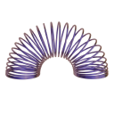

[](image.png)
# three-nodetoy

three-nodetoy allows you to export and use NodeToy graphs directly in your threejs websites.

🌈 [Nodetoy](https://nodetoy.co) is the shader tool for the web. NodeToy provides creators a powerful editor to create incredible new shaders and visual effects.

[Website](https://nodetoy.co/) &mdash;
[Twitter](https://twitter.com/nodetoy) &mdash;

## Demos

[https://three-nodetoy.vercel.app/](https://three-nodetoy.vercel.app/)

## Example

```tsx

import * as THREE from "three";
import { NodeToyMaterial } from '@nodetoy/three-nodetoy';

let geometry = new THREE.PlaneGeometry(1, 1);
let material =  new NodeToyMaterial({ url: "https://draft.nodetoy.co/nFvoIaHuvkvm3uMa" });

let mesh = new THREE.Mesh(geometry, material);
mesh.position.x = 2;
scene.add(mesh);
```

## API

```ts
enum NodeToyCullMode {
  Front,
  Back,
  None,
};

interface NodeToyMaterialOptions {
  url: string;
  parameters?: any;
  toneMapped?: boolean;
  flatShading?: boolean;
  transparent?: boolean;
  cullMode?: NodeToyCullMode;
  verbose?: boolean;
  polygonOffset?: boolean;
  polygonOffsetFactor?: number;
  depthTest?: boolean;
  depthWrite?: boolean;
  envMapIntensity?: number;
};

const material = new NodeToyMaterial(options: NodeToyMaterialOptions);
```

#### url : `string`

Define the NodeToy material to load. To export a material, open up the NodeToy material, click on the menu icon (top left corner) and select `Export Project...`. You can then generate a draft for your material, the URL will be generated for you.

#### parameters? : `Object`

Specifying the uniforms to be passed to the shader code. Those can be defined within the NodeToy editor by swiching inputs from `constants` to `parameters`.

#### toneMapped : `Boolean`

Defines whether this material is tone mapped according to the renderer's toneMapping setting. Default is true.

#### flatShading?: `boolean`

Define whether the material is rendered with flat shading. Default is false.

#### cullMode?: `NodeToyCullMode`

Defines which side of faces won't be rendered - NodeToyCullMode.front, back or none. Default is NodeToyCullMode.Back.

#### verbose?: `boolean`

Whether to print the full log of the material. Only useful for development. Default is false. 

#### polygonOffset?: `boolean`

Whether to use polygon offset. Default is false. This corresponds to the GL_POLYGON_OFFSET_FILL WebGL feature.

#### polygonOffsetFactor?: `Integer`

Sets the polygon offset factor. Default is 0.

#### depthTest?: `boolean`

Whether to have depth test enabled when rendering this material. Default is true.

#### depthWrite? : `Boolean`

Whether rendering this material has any effect on the depth buffer. Default is true.

When drawing 2D overlays it can be useful to disable the depth writing in order to layer several things together without creating z-index artifacts.


#### envMapIntensity?: `number`

Set the intensity of the environment map. Default is 1.0.

---

## Contributing

We use [yarn](https://yarnpkg.com/), install the dependencies like this:

```bash
yarn
```

### Development

Run to build `three-nodetoy`

```bash
yarn dev
```

Then install the examples and run the local server

```bash
cd example
yarn install
cd ..
yarn demo
```

and visit `localhost:3001/demo/Basic` to browse the examples in `./example` folder.

### Build Library

```bash
yarn build
```

### Publish on npm

```bash
yarn deploy
```
